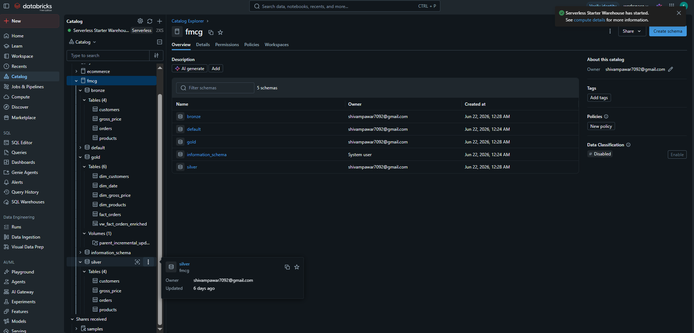

# fmcg-databricks-pipeline

# FMCG Lakehouse Pipeline — Atlon & SportsBar Unification

An end-to-end data engineering project built on **Databricks Free Edition**, simulating a real-world FMCG acquisition scenario where a major company (**Atlon**) acquires a startup (**SportsBar**). The core challenge: Atlon operates a structured ERP system, while SportsBar's data is fragmented across spreadsheets, APIs, and cloud drives. The objective is to build a reliable, unified data layer that resolves these inconsistencies and consolidates both entities into a single scalable lakehouse architecture using the **Medallion Architecture** (Bronze → Silver → Gold).

---

## Project Phases

### Phase 1 — Environment Setup & Data Ingestion
Setting up the Databricks environment, configuring AWS S3 for data ingestion, and establishing the Unity Catalog structure (catalog → schemas → volumes).

### Phase 2 — Pipeline Development
Building end-to-end pipelines to transform, clean, and consolidate dimension and fact tables across Bronze, Silver, and Gold layers for both Atlon and SportsBar.

### Phase 3 — Orchestration & Incremental Loading
Transitioning from a one-time historical backfill to an automated incremental load process for daily updates using Delta Lake's Change Data Feed (CDF) and Databricks Workflows.

### Phase 4 — Analytics & Dashboarding
Creating a denormalized Gold layer view to simplify reporting, followed by building a business-ready dashboard using Databricks Genie for Atlon leadership to monitor consolidated performance metrics.

---

## Architecture Overview

```
AWS S3 (Raw CSVs)
        │
        ▼
  ┌─────────────┐
  │   BRONZE    │  Raw ingestion with lineage tracking
  │             │  (file_name, file_size, read_timestamp)
  └──────┬──────┘
         │  PySpark Transformations
         ▼
  ┌─────────────┐
  │   SILVER    │  Cleaned, validated, deduplicated
  │             │  CDF enabled for incremental processing
  └──────┬──────┘
         │  Merge / Upsert (Delta Lake)
         ▼
  ┌─────────────┐
  │    GOLD     │  Star schema — dimensions + facts
  │             │  Unified parent + child company data
  └──────┬──────┘
         │
         ▼
  BI View (vw_fact_orders_enriched)
  Power BI / Databricks Genie
```

---

## Tech Stack

| Layer | Technology |
|---|---|
| Storage | AWS S3 |
| Compute | Apache Spark (PySpark) |
| Platform | Databricks Free Edition |
| Table Format | Delta Lake |
| Catalog | Unity Catalog |
| Languages | Python, SQL |
| Architecture | Medallion (Bronze / Silver / Gold) |
| AI Assistant | Databricks Genie |

---

## Project Structure

```
consolidated_pipeline/
│
├── 1_setup/
│   └── catalog and schema setup, volume creation
│
├── 2_dimension_data_processing/
│   ├── customers/       Bronze → Silver → Gold (dim_customers)
│   ├── products/        Bronze → Silver → Gold (dim_products)
│   └── gross_price/     Bronze → Silver → Gold (dim_gross_price)
│
└── 3_fact_data_processing/
    ├── orders/          Bronze → Silver → Gold (fact_orders)
    └── incremental/     Incremental load pipeline (CDF-based)
```

---

## Data Model

### Source Tables (Child Company — SportsBar)
- `customers` — customer master data
- `products` — product catalog with variants and categories
- `gross_price` — product pricing by year
- `orders` — daily order transactions

### Gold Layer (Unified — Atlon + SportsBar)

| Table | Type | Description |
|---|---|---|
| `dim_customers` | Dimension | Unified customer master |
| `dim_products` | Dimension | Unified product catalog |
| `dim_gross_price` | Dimension | Product pricing by year |
| `dim_date` | Dimension | Date attributes (month, quarter, year) |
| `fact_orders` | Fact | Unified monthly orders (parent + child) |
| `vw_fact_orders_enriched` | BI View | Denormalized view for reporting |

---

## Key Features

### 1. Medallion Architecture
Data flows through three layers:
- **Bronze** — raw ingestion from S3 with metadata columns (`file_name`, `file_size`, `read_timestamp`) for lineage tracking
- **Silver** — data cleaning, validation, type casting, deduplication, and business rule application
- **Gold** — star schema with dimensions and facts, merged from both Atlon (parent) and SportsBar (child)

### 2. Incremental Load with Change Data Feed (CDF)
- Delta Lake CDF enabled on Bronze tables (`delta.enableChangeDataFeed = true`)
- Silver layer reads only changed rows using `readChangeFeed` with `startingVersion`
- Gold layer uses **upsert (MERGE)** logic — updates existing rows, inserts new ones

### 3. Parent + Child Data Unification
- **Grain mismatch handled** — parent has monthly data, child has daily data. Child daily orders are aggregated to monthly grain using `trunc(date, 'MM')` + `groupBy` before merging into Gold
- **Key standardization** — child company `product_code` generated using SHA-256 hash on `product_name` for source-system independence
- **Type alignment** — `customer_code` cast to consistent type across both sources before merge

### 4. Data Quality Handling
- City name typos corrected using a validated mapping dictionary (`replace` + `isin` allowlist)
- Business-confirmed corrections applied for null values (e.g., customer cities confirmed by business team)
- Invalid values flagged as `"Unknown"` rather than silently dropped — preserving data quality visibility
- Gross price validation using regex — invalid non-numeric values handled explicitly

### 5. Delta Lake Features Used
- **Time Travel** — used `DESCRIBE HISTORY` + `RESTORE TABLE` to recover a corrupted Gold table
- **Schema Evolution** — `mergeSchema` and `overwriteSchema` for handling schema changes across pipeline runs
- **MERGE / Upsert** — `whenMatchedUpdateAll()` + `whenNotMatchedInsertAll()` for all Gold layer writes
- **COPY INTO** — used for loading parent company incremental CSV updates into Gold

### 6. BI-Ready Denormalized View
```sql
CREATE OR REPLACE VIEW fmcg.gold.vw_fact_orders_enriched AS
SELECT
    fo.date,
    dd.year, dd.month_name, dd.quarter,
    dc.customer, dc.market, dc.platform, dc.channel,
    dp.division, dp.category, dp.product, dp.variant,
    fo.sold_quantity,
    gp.price_inr,
    (fo.sold_quantity * gp.price_inr) AS total_amount_inr
FROM fmcg.gold.fact_orders fo
LEFT JOIN fmcg.gold.dim_date dd     ON fo.date = dd.month_start_date
LEFT JOIN fmcg.gold.dim_customers dc ON fo.customer_code = dc.customer_code
LEFT JOIN fmcg.gold.dim_products dp  ON fo.product_code = dp.product_code
LEFT JOIN fmcg.gold.dim_gross_price gp
       ON fo.product_code = gp.product_code
      AND YEAR(fo.date) = gp.year;
```

---

## Technical Challenges Solved

**1. Grain Mismatch (Daily → Monthly)**
Parent company stores data at monthly grain, child at daily grain. Solved by aggregating child daily orders to monthly using `trunc(date, 'MM')` + `groupBy` + `sum` before the Gold merge.

**2. Schema Evolution Across Layers**
A column rename (`varient` → `variant`) cascaded across Silver and Gold layers. Fixed by correcting the root cause in Silver and using `ALTER TABLE RENAME COLUMN` to avoid dropping and recreating the Gold table.

**3. Silent Merge Failures Due to Type Mismatch**
`customer_code` was `string` in child data but `BIGINT` in parent Gold table, causing the merge condition to silently fail to match rows. Diagnosed through `DESCRIBE HISTORY` → `operationMetrics` and fixed with explicit casting.

**4. Data Recovery with Time Travel**
A corrupted Gold table was recovered using Delta Lake's `RESTORE TABLE TO VERSION AS OF` — no data loss, no manual CSV reloads needed.

**5. Lineage Tracking at Row Level**
Each Bronze row captures `_metadata.file_name`, `_metadata.file_size`, and `read_timestamp` — enabling traceability of every record back to its source file and ingestion time.

---

## Screenshots

### Unity Catalog


### Gold View Output


### Delta Table History


### Bronze Lineage


### Dashboard


---

## How to Run

1. Set up Databricks Free Edition workspace
2. Create an AWS S3 bucket and upload source CSVs to respective landing folders
3. Run `1_setup` notebooks to create catalog, schemas, and volumes
4. Run `2_dimension_data_processing` notebooks (customers → products → gross_price)
5. Run `3_fact_data_processing` notebooks (orders → incremental load)
6. Query `fmcg.gold.vw_fact_orders_enriched` for BI reporting

---

## Author

**Shivam Pawar**
Senior Systems Engineer → Data Engineer
[LinkedIn](#) | [GitHub](#)
